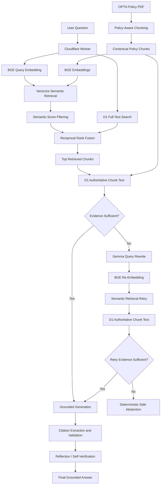

# PolicyLens — Self-Correcting Healthcare RAG

PolicyLens is an evidence-grounded healthcare policy intelligence system built with Cloudflare Workers, Workers AI, D1, and Vectorize.

The current implementation uses the OPTN policy corpus to demonstrate policy-aware document processing, hybrid retrieval, grounded generation, citation validation, answer verification, and **self-correcting retrieval**.

Unlike a standard RAG pipeline that retrieves once and immediately generates an answer, PolicyLens evaluates whether the retrieved evidence is sufficient before generation. When evidence is weak, the system rewrites the query using policy-oriented terminology and performs a second semantic retrieval attempt. If sufficient evidence still cannot be found, the system deterministically abstains rather than generating an unsupported answer.

> **Current status:** V2 complete — policy-aware chunking, hybrid retrieval, Reciprocal Rank Fusion, evidence-sufficiency assessment, conditional query rewriting and retrieval recovery, grounded generation, citation validation, reflection, safe abstention, an 8-case regression evaluation suite, and the PolicyLens web interface are implemented.

## Live Demo

**PolicyLens:**  
https://rag-reflection-system.gangulasravani1.workers.dev

The interface exposes not only the generated answer, but also:

- Evidence verification status
- Clickable source citations
- Cited OPTN policy sections
- Additional retrieved evidence
- Retrieval recovery status
- Safe-abstention behavior when evidence is insufficient

---

## Architecture



---

## How the Self-Correcting Retrieval Works

PolicyLens uses a bounded retrieval-recovery workflow rather than an unrestricted agent loop.

### 1. Initial Hybrid Retrieval

The user question is embedded using BGE and searched against Cloudflare Vectorize.

At the same time, D1 full-text search performs lexical retrieval.

```text
User Question
      ↓
BGE Embedding
      ↓
Semantic Search ───┐
                   ├── Reciprocal Rank Fusion
D1 FTS Search ─────┘
      ↓
Top Policy Evidence
```

Reciprocal Rank Fusion combines the semantic and lexical rankings.

### 2. Evidence Sufficiency Assessment

Before generating an answer, Gemma evaluates whether the retrieved policy evidence actually addresses the user's question.

The assessment produces structured output containing:

```json
{
  "sufficient": true,
  "reason": "...",
  "rewrittenQuery": ""
}
```

If the evidence is sufficient, PolicyLens proceeds to grounded generation.

### 3. Conditional Query Rewrite

If the initial evidence is insufficient, the model rewrites the user's question into a concise query using terminology more likely to appear in formal policy documents.

For example, a conversational question about someone who previously donated an organ can be rewritten into terminology more closely aligned with OPTN policy language.

Only one retrieval retry is allowed.

### 4. Semantic Retrieval Recovery

The rewritten query is embedded again and used for a second semantic search.

```text
Insufficient Evidence
        ↓
Query Rewrite
        ↓
BGE Re-Embedding
        ↓
Vectorize Retry
        ↓
New Policy Evidence
```

The recovered evidence is then evaluated again.

### 5. Second Sufficiency Gate

PolicyLens does not assume that a retrieval retry automatically solved the problem.

The recovered evidence must independently pass a second evidence-sufficiency assessment.

This distinction is important when retrieved evidence is related to the question but does not actually answer it.

For example, policy evidence describing:

- two-year living-donor follow-up reporting, or
- ten-year storage of donor testing specimens

does not by itself establish how long an entire living-donor medical record must be retained.

### 6. Deterministic Safe Abstention

If the second evidence assessment still finds the retrieved context insufficient, generation is skipped.

PolicyLens returns:

```text
I do not have enough information in the retrieved
OPTN policy evidence to answer this question.
```

This prevents the generation model from filling evidence gaps with unsupported information.

### 7. Grounded Generation and Citation Validation

When evidence is sufficient, Gemma generates an answer using only the retrieved policy context.

Answers reference sources using markers such as:

```text
[Source 1]
```

The API validates these source references against the active retrieved evidence before returning citations.

### 8. Reflection / Self-Verification

The generated answer is then evaluated against the retrieved evidence.

The reflection stage checks whether the answer is supported by the provided policy context and can identify unsupported claims before the final response is returned.

---

## PolicyLens Web Interface

PolicyLens includes a lightweight web interface served directly from the Cloudflare Worker.

The UI uses the same `/search` API as programmatic clients and adds a human-readable layer over the RAG workflow.

### Answer View

The interface displays:

- Generated answer
- Evidence-support status
- Clickable source citations
- Cited policy evidence
- Other retrieved policy sections

Clicking a citation automatically opens the corresponding policy evidence.

### Retrieval Trace

The interface also exposes a simplified retrieval trace.

A direct successful retrieval may appear as:

```text
Relevant policy evidence found
        ↓
Answer verified
```

A successful self-correction may appear as:

```text
More evidence needed
        ↓
Search refined
        ↓
Relevant evidence recovered
        ↓
Answer verified
```

If sufficient evidence cannot be recovered:

```text
More evidence needed
        ↓
Search refined
        ↓
Evidence still insufficient
        ↓
Unsupported answer prevented
```

The UI intentionally presents a simplified workflow while detailed retrieval diagnostics remain available in the API response.

---

## Current Features

- REST API for ingestion and question answering
- OPTN policy-aware hierarchical chunking
- Policy, section, and subsection metadata preservation
- Sentence-aware splitting for oversized policy sections
- Controlled overlap when sections require multiple chunks
- Context headers attached to policy chunks
- 384-dimensional BGE embeddings
- Cloudflare Vectorize semantic retrieval
- D1 full-text lexical retrieval
- Semantic similarity filtering
- Reciprocal Rank Fusion hybrid retrieval
- Authoritative chunk retrieval from D1
- Pre-generation evidence-sufficiency assessment
- Conditional policy-oriented query rewriting
- Semantic retrieval retry
- Second evidence-sufficiency validation
- One-retry bounded recovery workflow
- Deterministic safe abstention
- Grounded answer generation using Gemma
- Source citation extraction
- Citation validation against retrieved evidence
- Reflection/self-verification
- Retrieval diagnostics
- Input validation and JSON error handling
- 8-case RAG regression evaluation suite
- Responsive PolicyLens web interface
- Clickable citations
- Cited-vs-retrieved evidence separation
- Retrieval-recovery visualization

---

## Technology Stack

| Technology | Purpose |
|---|---|
| TypeScript | API, retrieval, validation, and Worker implementation |
| JavaScript / Node.js | OPTN PDF processing, evaluation, and ingestion utilities |
| Cloudflare Workers | Serverless application runtime |
| Workers AI | Embeddings, generation, query rewriting, sufficiency assessment, and reflection |
| Cloudflare D1 | Authoritative policy chunks and lexical retrieval |
| Cloudflare Vectorize | Dense semantic retrieval |
| Reciprocal Rank Fusion | Semantic + lexical ranking fusion |
| HTML / CSS / JavaScript | PolicyLens web interface |
| Wrangler | Local development and Cloudflare deployment |
| Vitest | Testing framework |

---

## Models

### Embedding Model

```text
@cf/baai/bge-small-en-v1.5
```

- Embedding dimensions: 384
- Used for policy chunks
- Used for user queries
- Used again when a rewritten retrieval query requires a retry

### Generation / Reasoning Model

```text
@cf/google/gemma-4-26b-a4b-it
```

Gemma is used for several bounded reasoning tasks:

- Evidence-sufficiency assessment
- Retrieval query rewriting
- Grounded answer generation
- Post-generation reflection

Generation and verification are kept separate so that an answer is evaluated against the retrieved evidence after it is produced.

---

## OPTN Policy Processing

The system currently uses the OPTN policy corpus as its primary domain dataset.

Instead of splitting the policy PDF into arbitrary fixed-length blocks, the ingestion pipeline attempts to preserve the regulatory structure of the source document.

```text
OPTN Policy PDF
        ↓
PDF Text Extraction
        ↓
Policy Detection
        ↓
Section / Subsection Detection
        ↓
Section-Aware Chunking
        ↓
Sentence-Aware Splitting When Required
        ↓
Context Header + Metadata
        ↓
BGE Embedding
        ↓
D1 + Vectorize
```

The processed corpus contains:

```text
21 policies
412 parsed sections
530 final chunks
0 invalid chunks
0 oversized chunks
```

The average chunk contains approximately 226 words, with oversized policy sections split only when necessary.

Each chunk retains contextual information such as:

```json
{
  "policyNumber": "8",
  "policyTitle": "Allocation of Kidneys",
  "sectionNumber": "8.4.E",
  "sectionTitle": "Prior Living Organ Donors"
}
```

This allows retrieved text to preserve its policy identity even when individual sections are stored independently.

---

## Retrieval Strategy

### Semantic Retrieval

The user query is embedded using BGE and searched against Vectorize.

Semantic results below the configured similarity threshold are removed before fusion.

### Lexical Retrieval

D1 full-text search provides keyword-sensitive retrieval that complements semantic search.

This is useful for:

- Policy numbers
- Regulatory terminology
- Medical terminology
- Exact phrases
- Abbreviations

### Reciprocal Rank Fusion

The initial semantic and lexical rankings are combined using Reciprocal Rank Fusion.

Conceptually:

```text
RRF(d) = Σ 1 / (k + rank(d))
```

This allows documents that rank strongly in either retrieval system to contribute to the final ranking without directly comparing lexical and semantic score scales.

The resulting RRF score is a ranking score and should not be interpreted as cosine similarity.

### Recovery Retrieval

If initial evidence is insufficient, the rewritten query performs a second semantic retrieval against Vectorize.

The retry intentionally remains bounded to a single additional retrieval attempt.

---

## Example Recovery Scenario

Consider the conversational question:

```text
If someone donated an organ before and later needs
a kidney transplant, do they receive any priority?
```

The initial retrieval may favor policy sections discussing previous organ recipients rather than previous living donors.

The sufficiency evaluator detects that mismatch.

PolicyLens then:

```text
Initial retrieval
        ↓
Evidence insufficient
        ↓
Policy-oriented query rewrite
        ↓
Semantic retrieval retry
        ↓
Policy 8.4.E — Prior Living Organ Donors
        ↓
Evidence reassessment
        ↓
Grounded answer
```

If the relevant policy is not recovered, the system safely abstains instead of using unrelated prior-recipient policies to construct an answer.

---

## Safe Abstention Example

Question:

```text
How long must a transplant program preserve
living donor medical records?
```

Related retrieved policies may discuss:

- living-donor follow-up periods
- data-submission deadlines
- specimen storage requirements
- documentation within the medical record

However, related evidence does not necessarily establish a retention period for the complete medical record.

When the retrieved evidence does not directly support the requested rule, PolicyLens can return:

```text
I do not have enough information in the retrieved
OPTN policy evidence to answer this question.
```

This behavior demonstrates the distinction between **retrieval relevance** and **answer sufficiency**.

---

## Evaluation

V2 is evaluated using a focused **8-case regression suite** designed to exercise different retrieval and safety behaviors.

The suite includes:

- Direct factual retrieval
- Procedural retrieval
- Multi-chunk policy retrieval
- Conversational query requiring retrieval recovery
- Policy-terminology retrieval
- Cross-policy phrasing
- Unsupported policy-detail question
- Out-of-scope clinical-treatment question

### Current Regression Results

```text
8 / 8 cases behaved as expected

6 / 6 answerable cases:
Expected policy section retrieved

2 / 2 unsupported cases:
System abstained

Known V1 retrieval failure:
Recovered by V2 query rewrite + retrieval retry
```

These results describe the current regression suite only and are **not intended as a claim of generalized RAG accuracy**.

The evaluation suite is designed to protect known retrieval and safety behaviors as the system evolves.

Evaluation files:

```text
eval/eval-cases.json
eval/rag-eval.mjs
eval/eval-results.json
```

---

## API

### Search

```http
POST /search
Content-Type: application/json
```

Example request:

```json
{
  "query": "How is the Kidney Donor Profile Index calculated?"
}
```

The response includes the answer along with retrieval and verification diagnostics.

Example structure:

```json
{
  "query": "...",
  "answer": "...",
  "citations": [],
  "reflection": {
    "supported": true,
    "issues": [],
    "revisedAnswer": null
  },
  "retrievalAssessment": {
    "sufficient": true,
    "reason": "...",
    "rewrittenQuery": ""
  },
  "retryAssessment": null,
  "retrievalRetried": false,
  "retrievalQuery": "...",
  "sources": []
}
```

When recovery is required:

```text
retrievalRetried = true
```

and the response exposes both the initial and retry assessments for debugging and evaluation.

---

## Design Principles

PolicyLens is built around several principles for high-stakes document RAG.

### Retrieval Before Generation

The system does not treat the language model as the source of truth. Answers must be grounded in retrieved policy evidence.

### Relevance Is Not Sufficiency

A document can be topically related to a question without containing enough information to answer it.

PolicyLens explicitly evaluates this distinction.

### Bounded Self-Correction

Retrieval recovery is limited to one query rewrite and one retry rather than allowing an uncontrolled agent loop.

### Authoritative Text Storage

Vectorize is used for semantic discovery, while D1 retains the authoritative chunk text used for generation and citation.

### Fail Safely

When evidence remains insufficient, the system prefers abstention over unsupported completion.

### Observable Retrieval

The API exposes retrieval assessments, retry status, rewritten queries, citations, reflection results, and source evidence so retrieval behavior can be inspected rather than treated as a black box.

---

## Project Structure

```text
rag-reflection-system1/
│
├── src/
│   ├── index.ts
│   ├── ui.ts
│   └── chunk-policies.mjs
│
├── eval/
│   ├── eval-cases.json
│   ├── eval-results.json
│   └── rag-eval.mjs
│
├── migrations/
├── test/
│
├── optn_chunks.json
├── optn_policies.pdf
├── wrangler.jsonc
├── tsconfig.json
├── vitest.config.mts
├── package.json
└── README.md
```

---

## Development

Install dependencies:

```bash
npm install
```

Type-check:

```bash
npx tsc --noEmit
```

Run locally:

```bash
npx wrangler dev
```

Deploy:

```bash
npx wrangler deploy
```

Run the RAG regression evaluation:

```bash
node eval/rag-eval.mjs
```

---

## Current Version

### V1 — Hybrid Grounded RAG

Implemented:

- Policy-aware chunking
- Semantic retrieval
- D1 lexical retrieval
- Reciprocal Rank Fusion
- Grounded generation
- Citation validation
- Reflection
- Safe no-context handling

### V2 — Self-Correcting Retrieval

Implemented:

- Evidence-sufficiency assessment
- Conditional query rewriting
- Semantic retrieval retry
- Second sufficiency assessment
- Deterministic safe abstention
- Retrieval diagnostics
- 8-case regression suite
- PolicyLens web interface
- Clickable citations
- Evidence visualization
- Retrieval-recovery trace

---

## Future Work

Potential future improvements include:

- Larger and more diverse evaluation datasets
- Retrieval-quality metrics such as Recall@K and MRR
- Additional healthcare policy corpora
- Policy-version and effective-date tracking
- Improved structured citation metadata
- Automated regression testing in CI
- Retrieval observability dashboards
- Expanded adversarial and out-of-domain testing
- Comparison of alternative embedding and generation models

The current architecture intentionally remains bounded and interpretable before introducing additional agentic complexity.

---

## Disclaimer

PolicyLens is a technical demonstration of evidence-grounded retrieval and generation over healthcare policy documents.

It is not intended to provide medical advice, legal advice, transplant eligibility determinations, or clinical decision-making guidance. Users should consult the authoritative OPTN policy source and appropriate professionals for operational or clinical decisions.