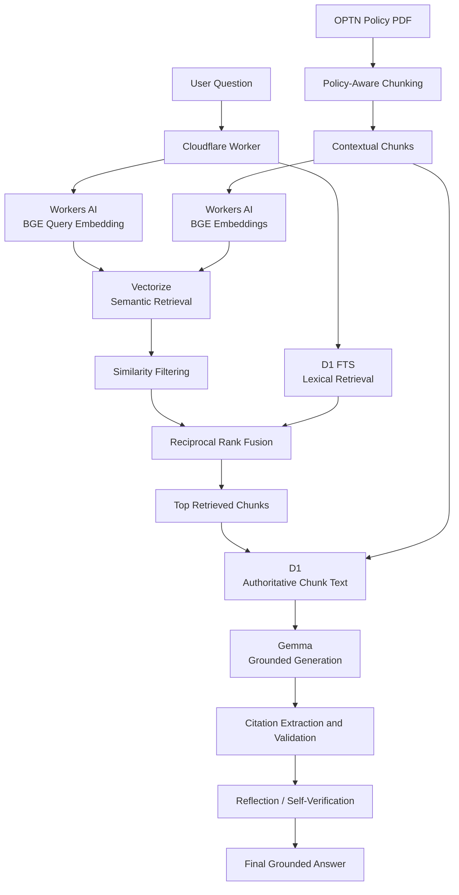

# Grounded Healthcare RAG API

A healthcare-focused retrieval-augmented generation (RAG) system built with Cloudflare Workers, Workers AI, D1, and Vectorize.

The current implementation uses the OPTN policy corpus to demonstrate policy-aware document chunking, hybrid retrieval, grounded generation, source citations, and answer reflection.

Rather than relying on generation alone, the system retrieves supporting policy evidence before answering and verifies the generated response against the retrieved context.

> **Current status:** V1 complete — policy-aware chunking, hybrid retrieval, Reciprocal Rank Fusion, grounded generation, citations, reflection, safe abstention, and initial RAG evaluation are implemented.

## Architecture



## Current Features

- REST API for document ingestion and question answering
- OPTN policy-aware hierarchical chunking
- Policy, section, and subsection metadata preservation
- Sentence-aware splitting for oversized sections
- Controlled overlap when sections require multiple chunks
- 384-dimensional BGE embeddings
- Cloudflare Vectorize semantic retrieval
- D1 full-text lexical retrieval
- Cosine-similarity filtering
- Reciprocal Rank Fusion (RRF)
- Top-k evidence retrieval
- Authoritative chunk retrieval from D1
- Grounded answer generation using Gemma
- Source citation extraction and validation
- Reflection/self-verification of generated answers
- Safe abstention when retrieved evidence does not support an answer
- Token-usage reporting
- Input validation and JSON error handling
- Initial retrieval and groundedness evaluation

## Technology Stack

| Technology | Purpose |
|---|---|
| TypeScript | API and retrieval implementation |
| JavaScript / Node.js | OPTN PDF processing and ingestion |
| Cloudflare Workers | Serverless API runtime |
| Workers AI | Embeddings, generation, and reflection |
| Cloudflare D1 | Source documents, chunks, and lexical retrieval |
| Cloudflare Vectorize | Dense semantic retrieval |
| Reciprocal Rank Fusion | Hybrid retrieval fusion |
| Wrangler | Development and Cloudflare deployment |
| Vitest | Testing framework |

## Models

### Embedding Model

```text
@cf/baai/bge-small-en-v1.5
```

- Embedding dimensions: 384
- Pooling method: `cls`
- Used for both document chunks and user queries

### Generation and Reflection Model

```text
@cf/google/gemma-4-26b-a4b-it
```

Gemma is used for grounded answer generation and a subsequent reflection step that evaluates whether the answer is supported by the retrieved policy evidence.

## OPTN Policy Processing

The system currently uses OPTN policies as its primary domain corpus.

Instead of splitting the PDF into arbitrary fixed-length blocks, the ingestion pipeline attempts to preserve the document's regulatory structure.

```text
OPTN Policy PDF
        ↓
PDF text extraction
        ↓
Policy detection
        ↓
Section / subsection detection
        ↓
Section-aware chunking
        ↓
Sentence-aware splitting when required
        ↓
Context header + metadata
        ↓
BGE embedding
        ↓
D1 + Vectorize
```

Each chunk retains contextual metadata such as:

```json
{
  "policyNumber": "8",
  "policyTitle": "Allocation of Kidneys",
  "sectionNumber": "8.4.E",